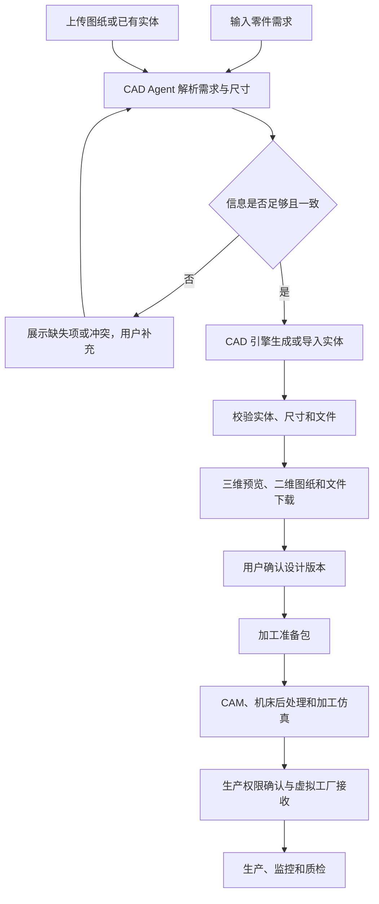

# 生产前零件三维建模设计

日期：2026-10-04

状态：设计草案，供用户确认；尚未实现建模或生产下发功能。

## 1. 目标与业务位置

在机器开始生产之前增加独立的“生产建模”环节。用户可以描述零件需求，也可以上传对应图纸。系统生成尺寸明确、经过几何验证、能够导出的 CAD 实体，为后续加工准备模型和图纸。

这是产品零件设计，不是维修方案，也不是把机器设备展示模型用作生产零件。原有 CAD 图纸查询、BOM 查询和工单故障定位保持不变。

用户提供的标准件清单可作为选型参考，但不限制需求只能选择清单中的 31 类零件。自定义零件由已支持的几何操作组合表达；无法表达的特征必须明确返回不支持，不能省略特征后声称完成。



“模型完成”“可进行加工准备”“机床可执行”和“生产已开始”是不同结果，分别记录。

## 2. 本地代码现状

本次检查以当前本地代码为依据，没有访问 GitHub，也没有修改生产配置。

- `services/agent-service/app/agents/cad/agent.py` 现有能力是 `bom_query`、`drawing_search`、`component_relation`。
- `services/agent-service/app/agents/cad/schemas.py` 只有工程查询输入，没有尺寸、几何特征或建模任务契约。
- `services/document-cad-service/app/main.py` 提供工程查询工具，没有建模、上传和模型文件输出接口。
- `services/document-cad-service/app/ingestion/parser.py` 的 STEP 处理是工程文档文本解析，不是实体建模或完整实体导入。
- `frontend/monitor-react/src/app/WorkbenchShell.jsx` 管理“生产运营”等导航分组，适合加入独立生产建模入口。
- Agent API 的 `/api/cad/resolve` 服务于维修定位，不能替换成新建模接口。
- Monitor 当前转发 `/api/cad/`，但新增上传和文件输出仍须验证请求大小、方法、鉴权及二进制内容转发。
- `FactoryApiClient` 目前只有设备发现、快照读取和启停控制，没有模型、加工程序或生产任务接收适配。
- 当前 `L:/anaconda/python.exe` 环境未发现 `cadquery` 和 `OCP`，已发现 `ezdxf`、`pymupdf`。这是依赖检查，不代表所有解析能力已经可用。

本次没有调用模型供应商、生产数据库或设备控制接口。

## 3. 技术路线与服务边界

推荐：模型解析需求，输出经过约束的结构化几何描述；CAD 内核执行实体建模。该路线可验证尺寸、追踪参数变化，并限制执行内容。

另一条路线是让模型直接编写并运行 CAD 脚本，表达更自由，但脚本执行隔离、资源控制和结果验证成本更高。首个实现不执行模型返回的任意脚本。

保留五服务架构，不新增业务 Agent：

| 部分 | 职责 |
| --- | --- |
| CAD Agent | 整理需求、请求补充参数、调用建模工具、组织结果和有限重试 |
| Document-CAD | 图纸与实体导入、参数建模、几何校验、文件存储与导出 |
| Model | 统一提供文字理解；具备可用视觉能力时处理图纸识别请求 |
| Backend | 保留既有业务持久化和质检职责；后续生产业务按真实接口契约接入 |
| RAG | 可提供已有标准件或工程知识证据，不充当尺寸缺失时的猜测器 |
| Monitor 前端 | 用户输入、上传、参数确认、三维预览、文件下载和任务状态 |

拟采用 CadQuery/OCCT 生成实体。STEP 用于实体交换，STL 用于预览网格；参数化设计描述另行保存，不声称 STEP 自带完整参数历史。二维视图由同一实体投影生成，尺寸标注由已验证的设计参数产生。

参考：[CadQuery 导入与导出](https://cadquery.readthedocs.io/en/latest/importexport.html)。

## 4. 两种输入流程

### 4.1 根据用户需求建模

1. 用户输入零件用途、形状、关键尺寸、单位和已知技术要求。
2. Model 经统一服务返回结构化设计描述，不直接执行模型生成的代码。
3. CAD Agent 校验几何操作、参数、约束和单位，展示缺失项与冲突。
4. 用户补充参数后生成新设计版本。每项尺寸记录用户输入或明确图纸来源。
5. 建模工具执行旋转体、拉伸、布尔运算、孔、槽、台阶、倒角、圆角和阵列等已注册操作。螺纹等特征只有真实实现并通过验证后才可标记完成，不用标注文字替代用户要求的实体特征。
6. 几何和输出文件校验通过后，提供预览、二维图纸及下载。

支持范围由实际注册且测试通过的操作决定，不能承诺所有自然语言描述均可自动建模。失败时保留需求及明细，不返回与需求不符的默认实体。

### 4.2 根据上传图纸建模

| 上传类型 | 处理方式与限制 |
| --- | --- |
| STEP/STP | 用 CAD 内核导入实体，识别单位、实体和装配层级，校验几何；不只是读取文本 |
| DXF | 提取选定图层的几何轮廓与已知标注；重建时必须明确拉伸厚度、旋转轴或其他三维约束 |
| PDF | 区分文本/矢量与扫描页，识别视图、尺寸和技术要求；信息足够时才重建实体 |
| PNG/JPG | 识别图纸中的标注和视图；无比例、缺少视图或无法辨认尺寸时要求补充 |
| DWG | 不属于首个版本的原生导入格式；需要可用且合法的转换器，否则提示转换为 DXF/PDF/STEP |

PDF 和图片识别属于独立解析能力。扫描图纸需要已验证的 OCR/视觉适配器；配置或能力不可用时不能声称识别成功。线上模型请求只经过 Model 服务，不从 CAD 服务直接调用供应商，不擅自更换用户选择的模型或供应商。

已有实体导入后的图纸缺少材料、公差等制造要求时，实体仍可查看和下载，但加工准备包必须显示缺失项。

## 5. 任务数据、版本和状态

核心记录包括：

- 任务编号、运行记录编号、创建者、请求来源和时间。
- 用户需求、图纸附件编号、文件摘要和解析结果。
- 设计版本、单位、尺寸、特征树、约束与参数来源。
- 材料、公差、表面要求、毛坯和目标机型等已知制造信息。
- 缺失信息、冲突、实际支持的特征及未支持特征。
- 工具输入输出、模型服务调用元数据、几何校验与错误。
- STEP、预览网格、二维图纸、参数描述的文件编号与摘要。
- 用户确认的版本摘要；生产交接状态单独记录。

建模状态迁移：

```text
received → analyzing → needs_input / queued / unsupported / failed
needs_input → analyzing（补充输入形成新版本）
queued → modeling → validating → ready / needs_input / failed
ready → confirmed（确认特定版本）
ready / confirmed → 新版本 received（修改需求，不覆盖旧成果）
```

确认使用服务端身份及版本摘要，客户端不能通过 `approved=true` 或上下文声明跳过确认。参数变化使原版本确认失效，但不会删除旧版本记录。

完整实体的最低校验包括：符合预期的实体数量、有效拓扑、闭合实体、正体积、单位正确、关键尺寸符合明确输入，以及 STEP 导出后重新导入仍有效。几何有效不自动代表材料、公差或加工工艺合格。

加工准备包只有制造必需信息完整且设计版本已确认后才能标记完成。缺少工艺能力或机床适配时分别返回不可用，不把未检测当作通过。

## 6. 输出与前端

在“生产运营”下增加“生产建模”，放在监控中心之前。新增独立组件，不继续把所有逻辑堆入现有 `App.jsx`，也不重做现有前端。

页面按上下排布：需求输入/图纸上传 → 参数与缺失项 → 三维预览 → 校验结果 → 输出文件 → 设计确认和加工准备。三维窗口提供旋转、缩放、适配视角及全屏。

输出要求：

- STEP 实体文件，支持下载和被标准 CAD 软件读取。
- 预览网格与参数化设计描述，预览数据从已校验的实体生成。
- 二维视图及尺寸图，提供 DXF/SVG，中文 PDF 作为独立绘图导出能力实现和验证。
- 版本、单位、材料及校验信息明确显示；未提供的值保持缺失。
- 导入 STEP 的输出标明“导入模型”，不能假称重建了未知的参数历史。

一轮建模形成一个独立运行记录，工具调用、输入、输出和错误归属于该记录，不混入故障闭环或维修工单。

## 7. 拟新增接口与执行约束

以下是拟新增的本项目内部契约，不是已经存在的外部工厂接口：

| Agent 对外接口 | 用途 |
| --- | --- |
| `POST /api/cad/designs` | 文字需求创建建模任务，快速返回任务编号 |
| `POST /api/cad/designs/import` | 上传图纸或实体，创建导入/重建任务 |
| `GET /api/cad/designs` | 查看有权访问的建模任务 |
| `GET /api/cad/designs/{id}` | 查询参数、缺失项、阶段和实际结果 |
| `POST /api/cad/designs/{id}/revisions` | 补充或修改需求，产生新版本 |
| `POST /api/cad/designs/{id}/confirm` | 确认指定版本与摘要，不触发机器启动 |
| `GET /api/cad/designs/{id}/artifacts/{artifact_id}` | 查看或下载已授权的结果文件 |

CAD Agent 通过少量结构化工具连接 Document-CAD 的任务提交、状态和结果接口。原有工程查询工具不变。建模调用进入现有工具注册及 Trace 边界，不新增与当前 Runtime 并行的隐藏编排系统。

耗时识别和几何操作在有界后台任务与隔离工作进程中执行，具有运行时限和资源限制，不长期占用请求线程或数据库写事务。只对确认为未执行的可安全操作重试；提交超时先通过任务和幂等身份对账，不重新制造重复任务。

幂等身份包括操作、调用者、需求版本和附件摘要。相同键对应不同参数返回冲突，不能复用旧结果。

上传校验文件类型、大小、页数及几何复杂度；限制解压和解析资源。文件使用服务端生成的编号，不允许路径穿越、任意本地路径读取或任意远程 URL 抓取。不执行上传文件或模型输出中的程序、宏与指令。

修改入口沿用现有鉴权规则，查询与下载核验访问范围。Monitor 保持同源与认证转发，内部 CAD 工具端点不直接暴露给浏览器。

文件持久化目录与数据库元数据保持一致。元数据经 CAD 仓储边界保存，新增表使用保留旧数据的迁移。测试使用临时目录及隔离数据库，不能隐式连接本地生产配置。输出先写临时文件，校验成功后提交有效文件记录，不留下指向半成品的成功状态。

## 8. 交给机器的边界

本次子项目负责“生产前完整建模、上传、验证、下载和设计交接包”。用户最终希望机器根据成果生产，这一目标保留，但 CAM 与机床下发是后续单独适配的子项目，不能用现有启停接口冒充加工任务接口。

加工通常还需要毛坯、装夹、刀具、工序、控制器与后处理、刀路仿真。现有标准件清单中的建议材料及加工范围不自动成为已确认工艺参数。

参考：[Autodesk 加工流程说明](https://help.autodesk.com/view/fusion360/ENU/?guid=GUID-BEC5DEA9-AC3E-4FA8-998E-4AE8CD0D0B1E)。

交接包包含冻结的设计版本、文件摘要、单位、制造要求和目标机型；没有已验证的加工适配器时，界面明确显示“模型已完成，生产接口未接入”。不会返回假的加工程序、固定生产成功或模拟成真实设备验收。

机器接收接口必须依据虚拟工厂实际提供的源码或接口文档实现。当前本项目中未找到该服务的生产程序接收实现，因此不预设一个不存在的外部 API。本次不发送启停、程序加载或生产开始命令。

## 9. 回归与验收设计

实施时先补测试，再实现对应行为；不通过模拟被测几何函数制造通过。

- 自然语言入口：使用隔离模型适配器提供结构化响应，真实调用请求校验、Agent 分支和工具边界；测试缺失尺寸、冲突、无效操作、模型异常和任务日志归属。
- 实体建模：真实 CAD 内核生成带孔台阶轴、定位环和非标带槽零件等样例，核对明确尺寸、实体数量、拓扑、体积和 STEP 导入导出一致性。样例用于验收，不限制目录范围。
- STEP/DXF：测试单位、装配、轮廓闭合、所选图层、缺少三维约束、损坏文件及原始附件保留。
- PDF/图片：测试真实解析器与隔离识别适配器，确保标注缺失/冲突、识别不可用和视图不充分均不会被判为完整模型。
- 文件/API：上传大小与类型限制、鉴权、文件越权、路径穿越、打开下载、正确 Content-Type 和 Content-Disposition。
- 作业与版本：同命令幂等、不同参数冲突、并发修改、超时对账、服务重启后的任务与文件一致性、修改后重新确认。
- 界面：两种入口、上下布局、模型查看、缺失项、状态轮询、版本切换、打开下载，以及生产未接入提示。
- 旧功能：CAD 设备归属验证、工单故障定位、Runtime 工具契约和五服务契约继续通过。
- 验证顺序：针对性测试 → CAD/Agent/Model 相关回归 → 跨服务契约 → 当前源码前端构建 → 环境允许时本地联调。

测试不得调用收费模型、生产数据库或真实设备。依赖不可用与业务回归失败分开记录；不能将跳过几何测试写成建模验收通过。

## 10. 实施与恢复约束

当前只新增本设计文档，尚未安装依赖、修改源码、迁移数据库或生成零件文件。已有本地修改全部保留。

设计确认后制定实施计划。实施前对每个待修改源码做独立备份，记录路径与校验摘要；不备份或输出密钥，不覆盖根目录生产配置。新增配置只补充模板和文档，不改变用户现有供应商选择。

恢复时先保留实施后新增的用户修改，再按清单逐文件恢复本次备份；不使用 Git 硬重置。数据迁移只新增结构，不删除旧工程记录或数据卷。建模文件和记录使用版本保留，不自动清理既有结果。

交付报告分别记录实际实现的建模操作、真实执行的测试、通过/失败/跳过数量、未验证能力与原因。生产下发未接入时，不能把模型导出成功写成机器生产成功。
